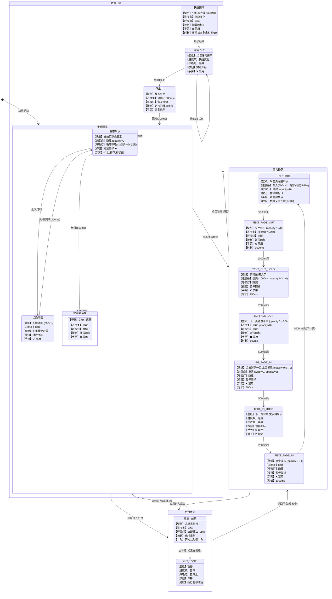

# 语伴（YuBan）设计文档

## 状态转移设计

本文档详细说明了应用中各个组件（壁纸、进度条、呼吸灯、播放按钮）在不同用户操作下的状态转移逻辑。

## 状态转移图

## 动画时序详细表

| 状态 | 壁纸动画 | 进度条 | 呼吸灯 | 按钮 | 总时长 |
|------|---------|--------|--------|------|--------|
| **手动浏览** |
| 静态显示 | - | 隐藏 | 2s淡入+2s淡出循环 | ▶️ | 持续 |
| 切换页面 | 300ms切换 | 隐藏 | 重置计时 | ▶️ | 300ms |
| **自动播放循环** |
| IDLE | 静态 | 1000ms淡入→增长 | 隐藏 | ⏸️ | 5-30s(动态) |
| TEXT_FADE_OUT | 文字1→0 | 1000ms淡出 | 隐藏 | ⏸️ | 1000ms |
| TEXT_OUT_HOLD | 静态 | 隐藏 | 隐藏 | ⏸️ | 250ms |
| BG_FADE_OUT | 背景0→50% | 隐藏 | 隐藏 | ⏸️ | 500ms |
| BG_FADE_IN | 背景50%→0 | 隐藏 | 隐藏 | ⏸️ | 500ms |
| TEXT_IN_HOLD | 静态 | 隐藏 | 隐藏 | ⏸️ | 250ms |
| TEXT_FADE_IN | 文字0→1 | 隐藏 | 隐藏 | ⏸️ | 1000ms |
| **暂停过渡** |
| 快速完成 | 10倍速 | 相应变化 | 隐藏 | 🔄 | 原时长/10 |
| 停止中 | 静态 | 1000ms淡出 | 恢复 | ▶️ | 300ms |

## 关键设计规则

### 1. 线性进度条设计细节

#### 显示特性
- **位置**：屏幕底部，与提示文字相同Y轴位置
- **尺寸**：宽度为屏幕的50%，高度2px，水平居中
- **颜色**：纯白色 (#FFFFFF)
- **透明度**：
  - 前景进度条：最大0.3
  - 背景轨道：前景透明度的30%（同步淡入淡出）

#### 生命周期
- **显示时机**：仅在自动播放的IDLE状态
- **渐入**：IDLE开始时，500ms淡入到opacity=0.3
- **增长**：随IDLE进度0%→100%，更新频率根据速度动态调整
  - 1倍速：每100ms更新
  - 10倍速：每20ms更新
- **保持**：TEXT_FADE_OUT期间保持100%显示
- **渐出**：TEXT_OUT_HOLD开始时，1秒淡出
- **重置**：BG_FADE_IN时重置为0

#### 特殊处理
- **10倍速优化**：
  - 动态调整更新频率，确保进度平滑
  - IDLE结束时强制发送100%进度
  - 避免进度条停在90%的问题
- **停止播放**：IDLE状态检测到非播放时，1秒淡出

### 2. 呼吸灯控制
- **活跃**：仅在手动浏览模式
- **周期**：2秒淡入 + 2秒淡出
- **中断**：切换页面时重置计时器
- **后台**：立即停止（0ms）
- **恢复**：返回前台且非播放状态时恢复

### 3. 手势控制
- **手动模式**：所有手势可用
- **播放模式**：所有手势禁用
- **保存对话框**：手势禁用
- **暂停过渡**：手势禁用直到完成

### 4. 动画时长计算
- **IDLE时长**：基础5秒 + (文字长度-10)*0.2秒，最大30秒
- **文字动画**：固定1000ms
- **背景过渡**：固定500ms
- **保持时间**：固定250ms
- **暂停加速**：所有动画10倍速

### 5. 状态保持原则
- 后台冻结当前状态
- 暂停时快速但平滑过渡
- 手动切换重置呼吸灯计时
- 播放循环自动继续

## 用户操作响应

### 点击播放按钮
- **前置条件**：处于手动浏览模式
- **动作**：
  1. 隐藏呼吸灯
  2. 切换按钮为暂停图标
  3. 禁用所有手势
  4. 进入IDLE状态
  5. 进度条开始渐入并增长

### 点击暂停按钮
- **前置条件**：处于自动播放模式（任意子状态）
- **动作**：
  1. 显示加载图标
  2. 10倍速完成当前动画
  3. 快速过渡到IDLE
  4. 进度条淡出
  5. 恢复呼吸灯
  6. 切换按钮为播放图标
  7. 恢复手势控制

### 上滑/下滑
- **前置条件**：手动浏览模式
- **动作**：
  1. 300ms切换动画
  2. 重置呼吸灯计时器
  3. 更新页面索引
  4. 预加载相邻页面

### 长按
- **前置条件**：手动浏览模式
- **动作**：
  1. 500ms后触发
  2. 显示保存对话框
  3. 暂停呼吸灯
  4. 禁用其他手势

### 进入后台
- **立即响应**：
  1. 停止呼吸灯（0ms）
  2. 冻结当前动画
- **10秒后**（如果在播放）：
  1. 执行暂停流程
  2. 保存播放状态

### 返回前台
- **从手动模式返回**：恢复呼吸灯
- **从播放模式返回**：
  - 如果未超时：继续播放
  - 如果已暂停：保持暂停状态，恢复呼吸灯

## 实现文件映射

| 功能模块 | 主要文件 | 说明 |
|---------|---------|------|
| 自动播放状态机 | `services/AutoPlayService.ets` | 7状态精细控制 |
| 呼吸灯动画 | `services/HintAnimationService.ets` | 呼吸效果管理 |
| 后台生命周期 | `services/BackgroundLifecycleService.ets` | 后台状态管理 |
| 进度条组件 | `components/LinearProgressComponent.ets` | 线性进度显示 |
| 主页面逻辑 | `pages/Index.ets` | 状态协调与UI更新 |
| 顶部控制栏 | `components/TopBarComponent.ets` | 播放/暂停按钮 |

## 性能优化策略

1. **预生成壁纸**：启动时预计算100个壁纸配置，避免运行时生成
2. **懒加载**：使用LazyForEach实现列表虚拟滚动
3. **动画优化**：使用硬件加速的opacity和transform动画
4. **状态批处理**：合并多个状态更新，减少重渲染
5. **内存管理**：及时清理不可见页面的资源

## 测试要点

### 功能测试
- [ ] 播放/暂停切换正确
- [ ] 进度条显示时机准确
- [ ] 呼吸灯在各状态下表现正确
- [ ] 手势在不同模式下的启用/禁用
- [ ] 后台10秒自动暂停
- [ ] 前台恢复逻辑

### 动画测试
- [ ] 所有动画时长符合设计
- [ ] 过渡动画流畅无闪烁
- [ ] 10倍速暂停过渡平滑
- [ ] 进度条渐入渐出正确

### 边界测试
- [ ] 快速连续点击播放/暂停
- [ ] 播放中进入后台再快速返回
- [ ] 极短/极长文字的显示时长
- [ ] 第一页/最后一页的循环切换

## 版本历史

### v2.3.0 (当前开发版)
- ✅ 实现线性进度条替代圆形进度指示器
- ✅ 进度条位于屏幕底部，与提示文字同一位置
- ✅ 进度条动画与文字动画完全同步：
  - IDLE开始时渐入（1000ms）
  - TEXT_FADE_OUT开始时渐出（1000ms）
- ✅ 修复10倍速时进度条停在90%的问题
- ✅ 进度条背景和前景同步淡入淡出
- ✅ 修复程序启动时文字闪烁问题
- ✅ 完善状态转移设计文档

### v2.2.0
- 实现100个壁纸配置预生成
- 添加后台生命周期管理
- 10秒自动暂停机制

### v2.1.0
- 根据文字长度动态调整播放时长
- 添加进度圈圈显示
- 修复保存图片功能

### v2.0.0
- 实现7阶段精细动画系统
- 添加10倍速暂停机制
- 重新设计UI控件